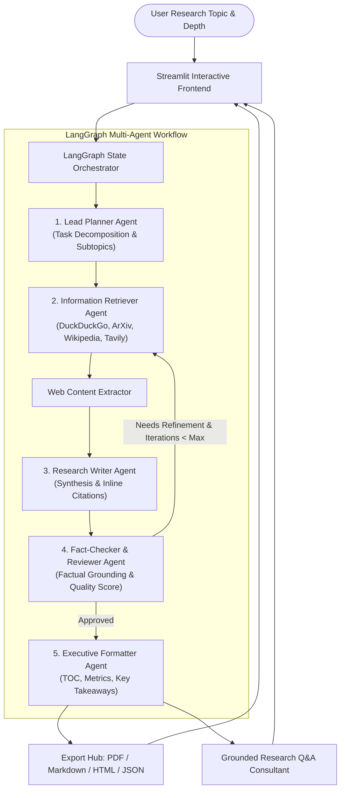

# 🧠 Multi-Agent AI Research Assistant

An autonomous, multi-agent AI research and information synthesis system built with **LangGraph**, **Streamlit**, **Python**, and multi-provider LLM support (**Google Gemini**, **OpenAI**, **Groq**, **Anthropic**, **Ollama**, and an offline **Mock Mode**).

---

## 🌟 Overview

The **Multi-Agent AI Research Assistant** coordinates specialized autonomous agents to execute end-to-end research workflows:
1. **Task Decomposition & Strategic Planning**: Breaks down complex research topics into analytical pillars, hypotheses, and targeted search queries.
2. **Multi-Source Information Retrieval**: Gathers and cross-references evidence from **DuckDuckGo**, **ArXiv** academic preprints, **Wikipedia**, and optional **Tavily AI Search**, scraping full text from target web pages.
3. **Structured Technical Synthesis**: Drafts rigorous, in-depth sections with inline numeric citations [1], [2] linked to the verified source catalog.
4. **Fact-Checking & Reflection Loops**: Audits the draft for factual fidelity, grounding, and completeness, executing targeted refinement loops if gaps exist.
5. **Executive Formatting & Export**: Packages publication-ready reports with Executive Summaries, Table of Contents, BibTeX/References, and one-click export to **PDF**, **Markdown**, **HTML**, and **JSON**.
6. **Interactive Consultation (Grounded Q&A)**: Enables follow-up questions answered strictly from the research context.

---

## 🏗️ Architecture & Multi-Agent Graph



---

## 🚀 Key Features

- **Autonomous Agent Squad**:
  - `PlannerAgent`: Formulates structured decomposition using Pydantic models.
  - `RetrieverAgent`: Multi-channel search with deduplication and relevance scoring.
  - `WriterAgent`: Section-by-section synthesis with strict citation anchors.
  - `ReviewerAgent`: Factual consistency check and reflection loop routing.
  - `QAAgent`: Grounded interactive follow-up agent.
- **Multi-Source Evidence Gathering**: DuckDuckGo (no key required), ArXiv (academic preprints), Wikipedia (encyclopedic foundation), and Tavily (deep search).
- **Multi-Provider LLM Engine**: Seamless switching between Google Gemini, OpenAI, Groq (Llama 3.3 70B), Anthropic Claude, Ollama local models, and offline Mock Mode.
- **Interactive Streamlit Interface**:
  - Real-time agent activity timeline and thought trace.
  - Interactive tabs for Final Report, Research Plan, Source Inspector, Quality Audit, and Follow-up Q&A.
  - One-click document export to **PDF** (via ReportLab), **Markdown**, **HTML**, and **JSON**.

---

## 📦 Installation & Quick Start

### 1. Clone or Open the Repository
```bash
cd "Multi-Agent AI Research Assistant"
```

### 2. Create and Activate Virtual Environment
```bash
python -m venv .venv
# On Windows:
.venv\Scripts\activate
# On Linux/macOS:
source .venv/bin/activate
```

### 3. Install Dependencies
```bash
pip install -r requirements.txt
```

### 4. Configure API Keys (Optional)
Copy the example environment file:
```bash
cp .env.example .env
```
*(You can also configure API keys directly inside the Streamlit sidebar at runtime, or select **Offline / Mock Mode** to test without any keys.)*

### 5. Launch the Streamlit App
```bash
streamlit run app.py
```
Or double-click `run_app.bat` on Windows.

---

## 🧪 Running Automated Tests

Run the test suite with pytest:
```bash
pytest
```

---

## 📂 Project Structure

```
Multi-Agent AI Research Assistant/
├── app.py                     # Streamlit application entry point
├── requirements.txt           # Project dependencies
├── run_app.bat                # Windows launcher batch script
├── .env.example               # Environment variables template
├── README.md                  # Documentation
├── src/
│   ├── config.py              # Configuration settings
│   ├── agents/
│   │   ├── planner.py         # Lead Planner Agent
│   │   ├── retriever.py       # Information Retrieval Agent
│   │   ├── writer.py          # Synthesis & Writer Agent
│   │   ├── reviewer.py        # Quality Reviewer & Fact-Checker
│   │   └── qa_agent.py        # Grounded Q&A Consultation Agent
│   ├── graph/
│   │   ├── state.py           # LangGraph TypedDict state schema
│   │   └── workflow.py        # StateGraph builder and conditional routing
│   ├── models/
│   │   └── schemas.py         # Pydantic structured output models
│   ├── tools/
│   │   ├── search_tools.py    # DuckDuckGo, ArXiv, Wikipedia, Tavily
│   │   └── web_scraper.py     # HTML text extraction utility
│   ├── utils/
│   │   ├── llm_factory.py     # Multi-provider LLM initializers & Mock LLM
│   │   └── exporter.py        # PDF, Markdown, HTML, and JSON generators
│   └── ui/
│       ├── styles.py          # Custom CSS and theming
│       └── components.py      # Modular Streamlit UI components
└── tests/
    ├── test_models.py         # Pydantic schema validation tests
    ├── test_tools.py          # Search and scraping tests
    ├── test_agents.py         # Agent node tests
    └── test_workflow.py       # LangGraph end-to-end execution tests
```
